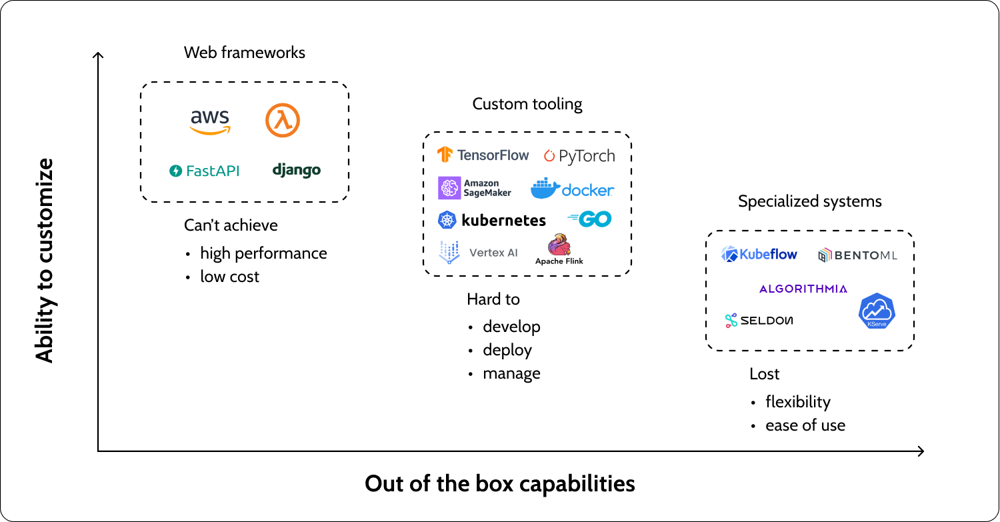
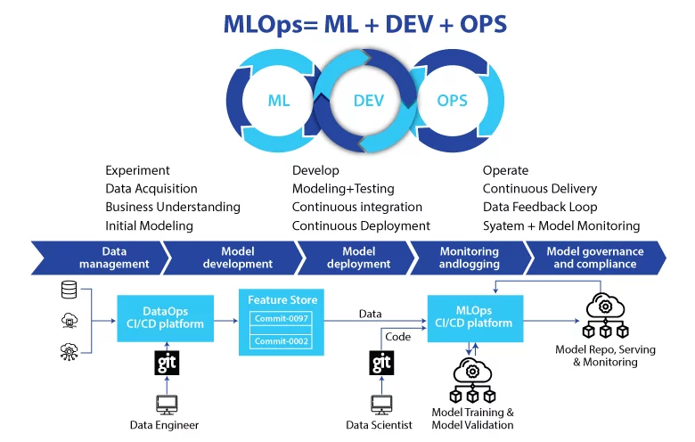

# MLops
MLOps, short for Machine Learning Operations, is a key aspect of Machine Learning engineering that focuses on efficiently deploying machine learning models into production and ensuring their ongoing maintenance and monitoring. It is a collaborative effort that typically involves data scientists, DevOps engineers, and IT professionals working together.

<div align="center">
  
  <p><em>This paper shows the Hidden Technical Debt in Machine Learning Systems. The paper discusses the challenges of deploying machine learning systems in production and the hidden technical debt that can accumulate over time. MLOps aims to address these challenges by providing best practices and tools for managing machine learning models in production.</em></p>
</div>

[reference](https://proceedings.neurips.cc/paper_files/paper/2015/file/86df7dcfd896fcaf2674f757a2463eba-Paper.pdf)


According to SIG MLOps(Special Interest Group for Machine Learning Operations), the best MLOps setup is one where machine learning models are handled just like any other software in a CI/CD(continous Integration/Continous Development) system. These models are deployed alongside the services that use them, as part of a smooth release process. By following these practices, we aim to speed up the use of AI in software and deliver smarter software faster. Below, we explain key ideas in MLOps, such as step-by-step development, automation, continous development, version control, testing, reproducibility, and monitoring. 


In this repository, we will cover various aspects of MLOps, including best practices, tools, and techniques for deploying, monitoring, and managing machine learning models in production. We will explore topics from backeend development to front-end development, and from data management to model training and validation. Moreover, we will also explore continuous integration and continuous deployment (CI/CD), model versioning, containerization, orchestration, and monitoring.

## Contents
1. [Introduction](#introduction)
2. [Process and TOOLs for MLOps](#Process-and-TOOLs-for-MLOps)
3. [MLOps Architecture](#MLOps-Architecture)


## Introduction
As machine learning and AI become more common in software, we need to create good practices and tools to help test, deploy, manage, and monitor these models in real-life situations. This is where MLOps comes in, helping to prevent pproblems in machine elarning applications.

<div align="center">
  
  <p><em>A common life cycle of MLOps engineering.</em></p>
</div>

[reference](https://www.databricks.com/glossary/mlops)


***What is the purpose of MLOps?***
MLOps is an effective method for building and improving machine learning and AI solutions. By using MLOps, data scientists and machine learning engineers can work together more efficiently, speeding up the development and deployment of models. It also incorporates continuous integration and deployment (CI/CD) practices, along with proper monitoring, validation, and management of ML models.

***Why do we need MLOps?***
Deploying machine learning models is challenging due to the complexity of the machine learning lifecycle, which includes tasks like data collection, preparation, model training, tuning, deployment, and monitoring. It also involves collaboration between teams such as Data Engineering, Data Science, and ML Engineering. MLOps helps streamline these processes, ensuring they work smoothly together through experimentation, iteration, and continuous improvement.

***What are the benefits of MLOps?***
MLOps offers key benefits like efficiency, scalability, and risk reduction. It makes model development faster, improves model quality, and speeds up deployment. MLOps supports scaling by allowing thousands of models to be managed and monitored through CI/CD pipelines. It also improves collaboration between teams and helps with the reproducibility of ML pipelines. In terms of risk reduction, MLOps ensures models comply with regulations, enhances transparency, and provides quicker responses to policy and regulatory needs.

***What are the key components of MLOps?***
The components of MLOps can be visualize and described as follows:

- Exploratory data analysis (EDA)
- Data Prep and Feature Engineering
- Model training and tuning
- Model review and governance
- Model inference and serving
- Model monitoring
- Automated model retraining


<div align="center">
  
  <p><em>Key components of MLOps.</em></p>
</div>

[reference](https://www.databricks.com/glossary/mlops)


######################################################################################

## Process and TOOLs for MLOps

```table
🚀 **MLOps Workflow** 🚀

        ⬇️                        ⬇️                             ⬇️
+---------------+        +-------------------+        +-----------------------+
|  Programming  |  ----> | Model Development |  ----> |    Model Training &   |
| (Python, ML   |        |  - Fasetapi       |        |    Validation         |
| Libraries)    |        |  - Sheldon Core   |        |                       |
+---------------+        +-------------------+        +-----------------------+
         ⬇️                       ⬇️                             ⬇️
+------------------+     +-------------------+        +-----------------------+
| Containerization | --->| Deployment (CI/CD)|  ----> |  Monitoring & Logging |
|   (Docker)       |     |  (Jenkins, etc.)  |        |  (Prometheus, Grafana)|
+------------------+     +-------------------+        +-----------------------+
        ⬇️                        ⬇️                             ⬇️
+------------------+     +-------------------+        +-----------------------+
| Version Control  | --->|  Orchestration    |  ----> | Scaling & Management  |
|    (Git)         |     |  (Kubernetes)     |        |  (Kubeflow, Seldon)   |
+------------------+     +-------------------+        +-----------------------+
```

*Programming Languagse*:
- **Python**

*ML Libraries*:
- **Scikit-learn**
- **TensorFlow or PyTorch**

*ML Model Deployment*
- **REST API Frameworks**: 
  - **FastAPI**, **Flask**, **Django**
- **Advanced Platforms**: 
  - **Seldon Core**: Kubernetes-native platform for deploying, scaling, and managing thousands of models.
  - **Kubeflow**: End-to-end orchestration for machine learning workflows on Kubernetes.
  - **TensorFlow Serving**: A flexible, high-performance serving system for machine learning models in production.
  - **TorchServe**: PyTorch-native model serving platform for large-scale deployment.

*Cloud Platforms & Deployment*
- **AWS**
- **Azure**
- **Google Cloud Platform**

*Deployment(CI/CD)*:
- **Jenkins**

*Container & Orchestration*:
- **Docker**
- **Kubernetes**

*Monitoring & Logging*:
- **Prometheus**
- **Grafana**

*Version Control*:
- **Git**

*Scaling & Management*:
- **Kubeflow**
- **Seldon**

*Data Management*:
- **Databricks**
- **Snowflake**


<div align="center">
  
  <p><em>Comparison of deployment platforms for machine learning models, highlighting the trade-offs between customization and out-of-the-box capabilities.</em></p>
</div>

[Reference](https://superwise.ai/blog/kserve-vs-seldon-core/)


#########################################################################################

## MLOps Architecture
In the following section we will focus on main components of MLOps architecture. The main components of MLOps architecture are as follows:

1. **Data Management**: This component is responsible for managing the data used in the machine learning pipeline. It includes data collection, storage, and preprocessing.[click here](./data_management/README.md)
2. **Model Development**: This component is responsible for developing machine learning models. It includes data preparation, feature engineering, model training, and model validation.[click here](./model_development/README.md)
3. **Model Deployment**: This component is responsible for deploying machine learning models into production. It includes model serving, model inference, and model monitoring.[click here](./model_deployement/README.md)
4. **Monitoring & Logging**: This component is responsible for monitoring and logging machine learning models in production. It includes tracking model performance, detecting model drift, and logging model predictions.[click here](./monitoring_and_logging/README.md)
5. **Model Governance & Compliance**: This component is responsible for ensuring that machine learning models comply with regulations and best practices. It includes model review, model governance, and model compliance.[click here](./model_governance_and_compliance/README.md)

<div align="center">
  
  <p><em>MLOps Architectures.</em></p>
</div>

[Reference](https://www.igmguru.com/blog/machine-learning-operations-mlops-overview-definition-and-architecture)


References:

- https://www.databricks.com/glossary/mlops
- https://medium.com/israeli-tech-radar/machine-learning-model-serving-overview-c01a6aa3e823