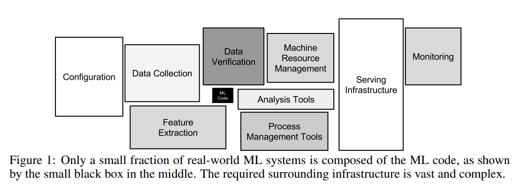
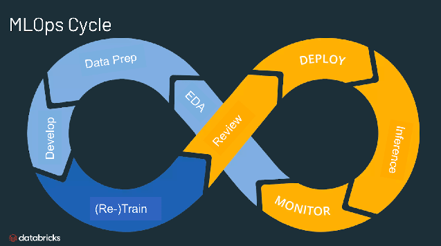
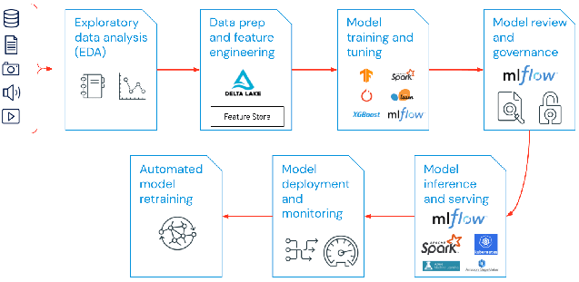

# MLops
MLOps, short for Machine Learning Operations, is a key aspect of Machine Learning engineering that focuses on efficiently deploying machine learning models into production and ensuring their ongoing maintenance and monitoring. It is a collaborative effort that typically involves data scientists, DevOps engineers, and IT professionals working together.

[reference](https://proceedings.neurips.cc/paper_files/paper/2015/file/86df7dcfd896fcaf2674f757a2463eba-Paper.pdf) - [this paper shows the Hidden Technical Debt in Machine Learning Systems. The paper discusses the challenges of deploying machine learning systems in production and the hidden technical debt that can accumulate over time. MLOps aims to address these challenges by providing best practices and tools for managing machine learning models in production.]

According to SIG MLOps(Special Interest Group for Machine Learning Operations), the best MLOps setup is one where machine learning models are handled just like any other software in a CI/CD(continous Integration/Continous Development) system. These models are deployed alongside the services that use them, as part of a smooth release process. By following these practices, we aim to speed up the use of AI in software and deliver smarter software faster. Below, we explain key ideas in MLOps, such as step-by-step development, automation, continous development, version control, testing, reproducibility, and monitoring. 

In this repository, we will cover various aspects of MLOps, including best practices, tools, and techniques for deploying, monitoring, and managing machine learning models in production. We will explore topics from backeend development to front-end development, and from data management to model training and validation. Moreover, we will also explore continuous integration and continuous deployment (CI/CD), model versioning, containerization, orchestration, and monitoring.

## Contents
1. [Introduction](#introduction)
2. [Process and TOOLs for MLOps](#Process-and-TOOLs-for-MLOps)
3. [Skills to be a Full MLops Engineer](#skills-to-be-a-full-mlops-engineer)

## Introduction
As machine learning and AI become more common in software, we need to create good practices and tools to help test, deploy, manage, and monitor these models in real-life situations. This is where MLOps comes in, helping to prevent pproblems in machine elarning applications.

A common life cycle of MLOps engineering is visualize below:

[reference](https://www.databricks.com/glossary/mlops)

***What is the purpose of MLOps?***
MLOps is an effective method for building and improving machine learning and AI solutions. By using MLOps, data scientists and machine learning engineers can work together more efficiently, speeding up the development and deployment of models. It also incorporates continuous integration and deployment (CI/CD) practices, along with proper monitoring, validation, and management of ML models.

***Why do we need MLOps?***
Deploying machine learning models is challenging due to the complexity of the machine learning lifecycle, which includes tasks like data collection, preparation, model training, tuning, deployment, and monitoring. It also involves collaboration between teams such as Data Engineering, Data Science, and ML Engineering. MLOps helps streamline these processes, ensuring they work smoothly together through experimentation, iteration, and continuous improvement.

***What are the benefits of MLOps?***
MLOps offers key benefits like efficiency, scalability, and risk reduction. It makes model development faster, improves model quality, and speeds up deployment. MLOps supports scaling by allowing thousands of models to be managed and monitored through CI/CD pipelines. It also improves collaboration between teams and helps with the reproducibility of ML pipelines. In terms of risk reduction, MLOps ensures models comply with regulations, enhances transparency, and provides quicker responses to policy and regulatory needs.

***What are the key components of MLOps?***
The components of MLOps can be visualize and described as follows:

- Exploratory data analysis (EDA)
- Data Prep and Feature Engineering
- Model training and tuning
- Model review and governance
- Model inference and serving
- Model monitoring
- Automated model retraining

[reference](https://www.databricks.com/glossary/mlops)

##########################################################################################################################

## Process and TOOLs for MLOps
+------------------+       +----------------------+       +-------------------------+
|    Programming   | ----> |   Model Development  | ----> |   Model Training and     |
| (Python, ML libs)|       |                      |       |      Validation          |
+------------------+       +----------------------+       +-------------------------+

      |                             |                                    |
      v                             v                                    v

+------------------+       +----------------------+       +-------------------------+
|  Containerization | ----> |   Deployment         | ----> |   Monitoring and         |
|   (Docker)        |       |  (CI/CD Tools)       |       |      Logging (Prometheus,|
+------------------+       +----------------------+       |         Grafana)         |
                                                         +-------------------------+
                                                             
      |                             |                                    |
      v                             v                                    v

+------------------+       +----------------------+       +-------------------------+
|   Version Control| ----> |   Orchestration       | ----> |   Scaling and            |
|     (Git)        |       |     (Kubernetes)      |       |   Workflow Management    |
+------------------+       +----------------------+       +-------------------------+

### Software
- **Python 3.8+**
- **Docker**
- **Kubernetes**
- **Git**

### Libraries and Tools
- **Scikit-learn**
- **TensorFlow or PyTorch**
- **MLflow**
- **Kubeflow**
- **Jenkins**
- **Prometheus**
- **Grafana**

### Hardware
- A machine with at least 8GB of RAM
- A stable internet connection

## Skills to be a Full MLops Engineer

### Technical Skills
1. **Programming**: 
   - Proficiency in Python.
   - Familiarity with ML libraries like TensorFlow, PyTorch, and Scikit-learn.
2. **Data Management**: 
   - Understanding data processing, transformation, and management tools.
3. **Model Training and Validation**: 
   - Experience with model training, hyperparameter tuning, and validation techniques.
4. **Version Control**: 
   - Knowledge of version control systems like Git.
5. **Continuous Integration/Continuous Deployment (CI/CD)**: 
   - Experience with CI/CD tools like Jenkins, GitLab CI, or GitHub Actions.
6. **Containerization**: 
   - Familiarity with Docker for containerization.
7. **Orchestration**: 
   - Experience with Kubernetes for orchestration.
8. **Cloud Services**: 
   - Experience with cloud platforms like AWS, Google Cloud Platform (GCP), or Microsoft Azure.
9. **Monitoring and Logging**: 
   - Skills in setting up and managing monitoring and logging tools like Prometheus, Grafana, and ELK stack.

### Soft Skills
1. **Problem-Solving**: 
   - Ability to identify, analyze, and solve problems efficiently.
2. **Collaboration**: 
   - Strong collaboration skills to work with cross-functional teams.
3. **Communication**: 
   - Excellent communication skills to explain technical concepts to non-technical stakeholders.
4. **Adaptability**: 
   - Ability to adapt to new tools, technologies, and methodologies quickly.
5. **Attention to Detail**: 
   - Keen attention to detail to ensure models are deployed and monitored correctly.

By developing these skills and fulfilling the software and hardware requirements, you will be well-equipped to pursue a career as a full MLops Engineer.

---

Feel free to explore the repository and make use of the resources provided to enhance your MLops skills.

[refrence](https://superwise.ai/blog/kserve-vs-seldon-core/)

References:

- https://www.databricks.com/glossary/mlops
- https://medium.com/israeli-tech-radar/machine-learning-model-serving-overview-c01a6aa3e823