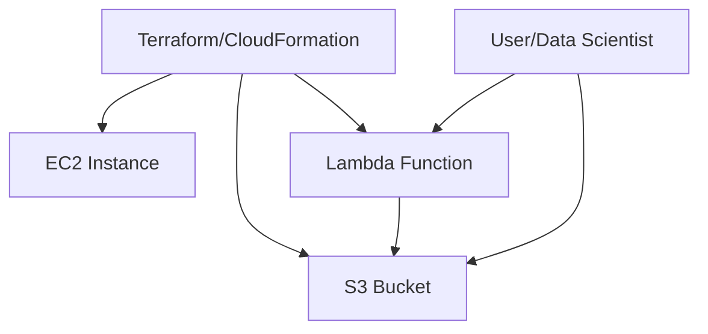
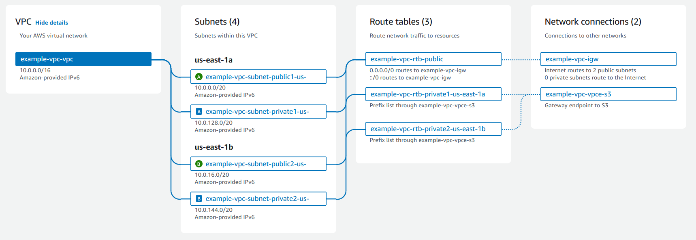

# AWS

# Tutorial: Setting Up and Deploying MLOps Infrastructure on AWS
---

## 6. Project-Specific Usage

This MLOps project uses AWS services as follows:
- **S3**: For storing raw/processed data, model artifacts, and logs.
- **EC2**: For running training jobs, batch processing, and hosting APIs.
- **Lambda**: For serverless automation, event-driven data processing, and notifications.
- **CloudFormation/Terraform**: For reproducible, automated infrastructure setup.

---

## 7. Cost Management Tips
- Use the [AWS Pricing Calculator](https://calculator.aws.amazon.com/) to estimate costs.
- Set up [AWS Budgets](https://docs.aws.amazon.com/cost-management/latest/userguide/budgets-managing-costs.html) to monitor spending.
- Always stop or terminate unused EC2 instances and clean up unused resources.
- Use S3 lifecycle policies to automatically delete old data if needed.

---

## 8. Security Best Practices
- Use IAM roles and policies with least privilege.
- Never commit AWS credentials or secrets to the repository.
- Enable Multi-Factor Authentication (MFA) on your AWS account.
- Use environment variables or AWS Secrets Manager for sensitive data.

---

## 9. Resource Cleanup Reminder
- Always destroy or delete resources (EC2, S3 buckets, Lambda functions, etc.) when no longer needed to avoid unexpected charges.
- Use `terraform destroy` or delete CloudFormation stacks to clean up infrastructure.

---

## 10. Troubleshooting
- **Permission errors**: Check IAM roles and policies.
- **Region mismatches**: Ensure your CLI/SDK/Console is set to the correct AWS region.
- **Resource limits**: Check AWS service quotas if you hit limits.
- **CLI errors**: Use `--debug` flag for more information.

---

## 11. More Information
- See the [Main Project README](../README.md) for a full project overview and context.

This guide will walk you through the steps to set up and deploy MLOps infrastructure on AWS using Terraform, CloudFormation, Lambda, S3, and EC2. Each section explains what the resource is, what the provided files do, and how to use them.

---

## 1. Prerequisites

- AWS account ([Sign up](https://aws.amazon.com/))
- AWS CLI installed and configured ([Install guide](https://docs.aws.amazon.com/cli/latest/userguide/getting-started-install.html))
- Terraform installed ([Install guide](https://developer.hashicorp.com/terraform/tutorials/aws-get-started/install-cli))
- (Optional) Docker, Python, Node.js as needed for Lambda or other services

---

## 2. AWS Infrastructure as Code

### a. Terraform (`terraform/`)

- **What is it?** Terraform is an open-source IaC tool for provisioning AWS resources.
- **What does it do?** The `main.tf` file provisions an S3 bucket as an example.
- **How to use:**
  1. `cd aws/terraform`
  2. `terraform init`  # Initialize Terraform
  3. `terraform plan`  # Preview changes
  4. `terraform apply` # Apply changes to AWS

### b. CloudFormation (`cloudformation/`)

- **What is it?** AWS CloudFormation is a native IaC service for AWS.
- **What does it do?** The `template.yaml` file creates an S3 bucket.
- **How to use:**
  1. Go to AWS Console > CloudFormation
  2. Create stack > Upload `template.yaml`
  3. Follow the prompts to deploy

### c. Lambda (`lambda/`)

- **What is it?** AWS Lambda lets you run code serverlessly.
- **What does it do?** `lambda_function.py` is a sample handler.
- **How to use:**
  1. Zip `lambda_function.py`
  2. Go to AWS Console > Lambda > Create function
  3. Upload the zip as code
  4. Set handler to `lambda_function.handler`

### d. S3 (`s3/`)

- **What is it?** AWS S3 is object storage for data, models, logs, etc.
- **What does it do?** This folder is for scripts/configs to manage S3 buckets and objects.
- **How to use:**
  - Use AWS CLI or SDKs to upload/download data
  - Example: `aws s3 cp myfile.txt s3://mlops-sample-bucket/`

### e. EC2 (`ec2/`)

- **What is it?** AWS EC2 provides virtual machines for compute workloads.
- **What does it do?** This folder is for scripts/configs to manage EC2 instances.
- **How to use:**
  - Use AWS Console, CLI, or IaC tools to launch/manage instances

---

## 3. Visualizing AWS Resources

---

## 4. Example Workflow

1. Use Terraform or CloudFormation to provision S3, EC2, and Lambda.
2. Upload data/models to S3.
3. Deploy Lambda for serverless tasks (e.g., data processing, triggers).
4. Use EC2 for training, batch jobs, or hosting services.
5. Monitor and manage resources via AWS Console or CLI.

---

## 5. References

- [AWS Documentation](https://docs.aws.amazon.com/)
- [Terraform AWS Provider](https://registry.terraform.io/providers/hashicorp/aws/latest/docs)
- [CloudFormation User Guide](https://docs.aws.amazon.com/AWSCloudFormation/latest/UserGuide/Welcome.html)
- [AWS Lambda Docs](https://docs.aws.amazon.com/lambda/latest/dg/welcome.html)
- [AWS S3 Docs](https://docs.aws.amazon.com/s3/index.html)
- [AWS EC2 Docs](https://docs.aws.amazon.com/ec2/index.html)

---

## DATA center

- VPC

## How Amazon VPC works

  
  
<em>VPC</em>

[reference](https://docs.aws.amazon.com/vpc/latest/userguide/how-it-works.html)

- VPC CIDR
- VPC and subnets

---

## EC2

---

## Example Usage

- Use `terraform/main.tf` to provision AWS resources via Terraform.
- Use `cloudformation/template.yaml` for CloudFormation-based deployments.
- Place Lambda function code in `lambda/`.
- Add S3/EC2 automation scripts in their respective folders.

# AWS

This directory contains AWS-specific infrastructure, automation, and deployment scripts for the MLOps project.

## Structure

- `terraform/`: Infrastructure as code using Terraform (e.g., S3, EC2, IAM)
- `cloudformation/`: AWS CloudFormation templates
- `lambda/`: AWS Lambda functions and deployment scripts
- `s3/`: S3 bucket/object management scripts
- `ec2/`: EC2 instance management scripts

---

## DATA center

- VPC

## How Amazon VPC works

  
  
<em>VPC</em>

[reference](https://docs.aws.amazon.com/vpc/latest/userguide/how-it-works.html)

- VPC CIDR
- VPC and subnets

---

## EC2

---

## Example Usage

- Use `terraform/main.tf` to provision AWS resources via Terraform.
- Use `cloudformation/template.yaml` for CloudFormation-based deployments.
- Place Lambda function code in `lambda/`.
- Add S3/EC2 automation scripts in their respective folders.
