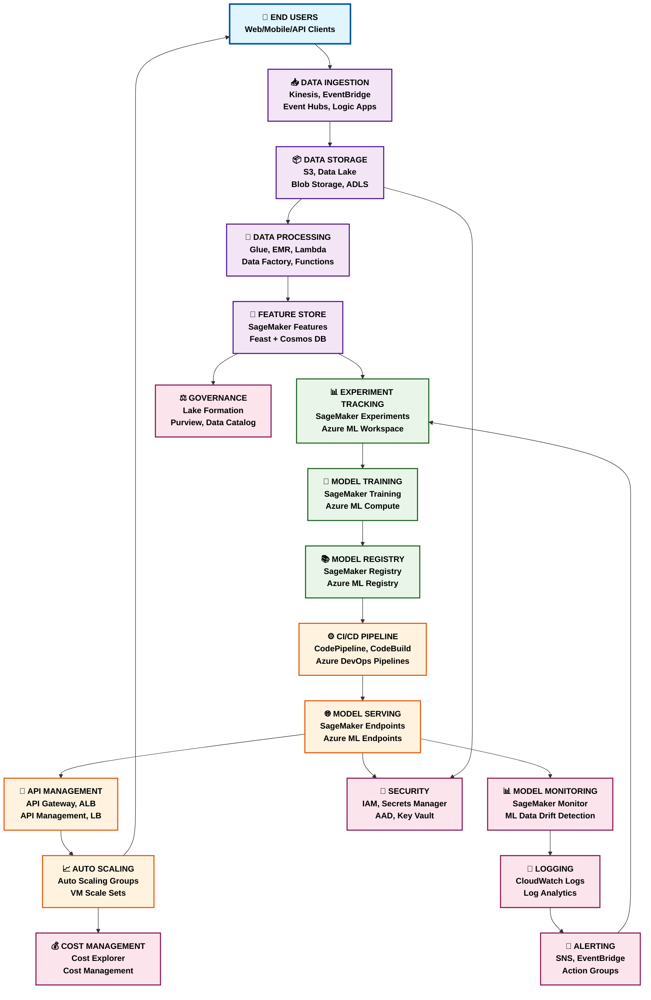
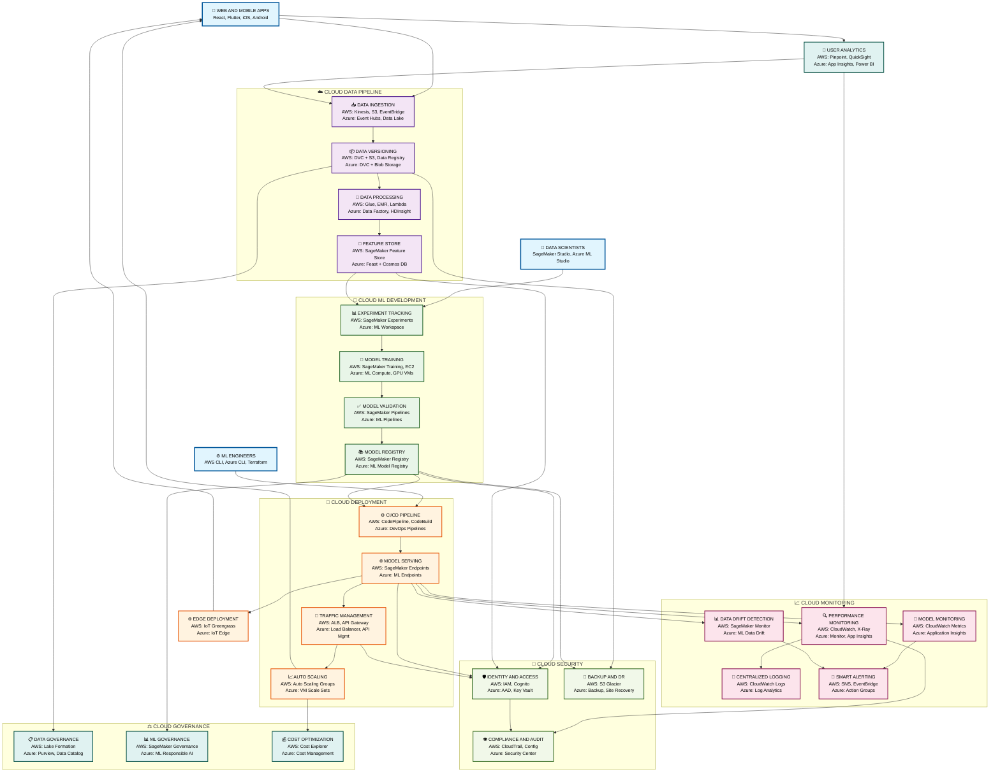
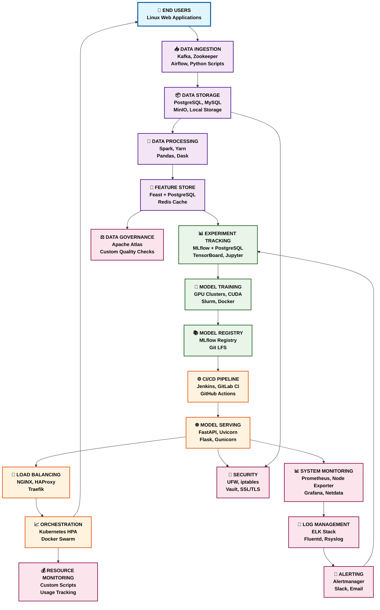
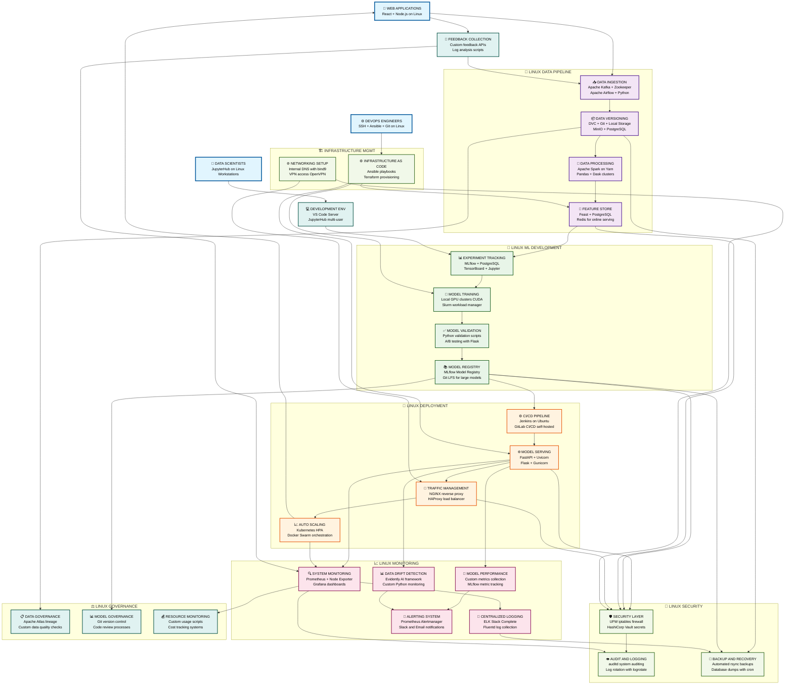

# MLOps Architecture Flowcharts

## 1. Cloud-based MLOps (End-to-End)

```mermaid
graph TB
    %% Styling with larger text
    classDef client fill:#e1f5fe,stroke:#01579b,stroke-width:3px,color:#000,font-size:16px,font-weight:bold
    classDef data fill:#f3e5f5,stroke:#4a148c,stroke-width:2px,color:#000,font-size:16px,font-weight:bold
    classDef ml fill:#e8f5e8,stroke:#1b5e20,stroke-width:2px,color:#000,font-size:16px,font-weight:bold
    classDef deploy fill:#fff3e0,stroke:#e65100,stroke-width:2px,color:#000,font-size:16px,font-weight:bold
    classDef ops fill:#fce4ec,stroke:#880e4f,stroke-width:2px,color:#000,font-size:16px,font-weight:bold

    %% Client Layer
    USERS["👤 END USERS<br/>Web/Mobile/API Clients"]
  
    %% Data Layer
    INGEST["📥 DATA INGESTION<br/>Kinesis, EventBridge<br/>Event Hubs, Logic Apps"]
  
    STORE["📦 DATA STORAGE<br/>S3, Data Lake<br/>Blob Storage, ADLS"]
  
    PROCESS["🔧 DATA PROCESSING<br/>Glue, EMR, Lambda<br/>Data Factory, Functions"]
  
    FEATURES["🏪 FEATURE STORE<br/>SageMaker Features<br/>Feast + Cosmos DB"]

    %% ML Development
    EXPERIMENT["📊 EXPERIMENT TRACKING<br/>SageMaker Experiments<br/>Azure ML Workspace"]
  
    TRAINING["🎯 MODEL TRAINING<br/>SageMaker Training<br/>Azure ML Compute"]
  
    REGISTRY["📚 MODEL REGISTRY<br/>SageMaker Registry<br/>Azure ML Registry"]

    %% Deployment & Serving
    PIPELINE["⚙️ CI/CD PIPELINE<br/>CodePipeline, CodeBuild<br/>Azure DevOps Pipelines"]
  
    SERVING["🌐 MODEL SERVING<br/>SageMaker Endpoints<br/>Azure ML Endpoints"]
  
    GATEWAY["🔀 API MANAGEMENT<br/>API Gateway, ALB<br/>API Management, LB"]
  
    SCALING["📈 AUTO SCALING<br/>Auto Scaling Groups<br/>VM Scale Sets"]

    %% Operations & Monitoring
    MONITOR["📊 MODEL MONITORING<br/>SageMaker Monitor<br/>ML Data Drift Detection"]
  
    LOGS["📝 LOGGING<br/>CloudWatch Logs<br/>Log Analytics"]
  
    ALERTS["🚨 ALERTING<br/>SNS, EventBridge<br/>Action Groups"]
  
    SECURITY["🔐 SECURITY<br/>IAM, Secrets Manager<br/>AAD, Key Vault"]
  
    GOVERNANCE["⚖️ GOVERNANCE<br/>Lake Formation<br/>Purview, Data Catalog"]
  
    COSTS["💰 COST MANAGEMENT<br/>Cost Explorer<br/>Cost Management"]

    %% Flow Connections
    USERS --> INGEST
    INGEST --> STORE
    STORE --> PROCESS
    PROCESS --> FEATURES
    FEATURES --> EXPERIMENT
    EXPERIMENT --> TRAINING
    TRAINING --> REGISTRY
    REGISTRY --> PIPELINE
    PIPELINE --> SERVING
    SERVING --> GATEWAY
    GATEWAY --> SCALING
    SCALING --> USERS
  
    %% Monitoring & Feedback
    SERVING --> MONITOR
    MONITOR --> LOGS
    LOGS --> ALERTS
    ALERTS --> EXPERIMENT
  
    %% Cross-cutting Concerns
    SERVING --> SECURITY
    STORE --> SECURITY
    FEATURES --> GOVERNANCE
    SCALING --> COSTS
  
    %% Apply Styles
    class USERS client
    class INGEST,STORE,PROCESS,FEATURES data
    class EXPERIMENT,TRAINING,REGISTRY ml
    class PIPELINE,SERVING,GATEWAY,SCALING deploy
    class MONITOR,LOGS,ALERTS,SECURITY,GOVERNANCE,COSTS ops
```

```mermaid
graph TB
    %% Styling
    classDef client fill:#e1f5fe,stroke:#01579b,stroke-width:3px,color:#000,font-size:14px
    classDef data fill:#f3e5f5,stroke:#4a148c,stroke-width:2px,color:#000,font-size:14px
    classDef ml fill:#e8f5e8,stroke:#1b5e20,stroke-width:2px,color:#000,font-size:14px
    classDef deploy fill:#fff3e0,stroke:#e65100,stroke-width:2px,color:#000,font-size:14px
    classDef monitor fill:#fce4ec,stroke:#880e4f,stroke-width:2px,color:#000,font-size:14px
    classDef security fill:#f1f8e9,stroke:#33691e,stroke-width:2px,color:#000,font-size:14px
    classDef governance fill:#e0f2f1,stroke:#004d40,stroke-width:2px,color:#000,font-size:14px

    %% Client Layer
    Client1["👤 WEB AND MOBILE APPS<br/>React, Flutter, iOS, Android"] 
    Client2["🔬 DATA SCIENTISTS<br/>SageMaker Studio, Azure ML Studio"]
    Client3["⚙️ ML ENGINEERS<br/>AWS CLI, Azure CLI, Terraform"]

    %% Data Pipeline
    subgraph DP1 ["☁️ CLOUD DATA PIPELINE"]
        DI["📥 DATA INGESTION<br/>AWS: Kinesis, S3, EventBridge<br/>Azure: Event Hubs, Data Lake"]
        DV["📦 DATA VERSIONING<br/>AWS: DVC + S3, Data Registry<br/>Azure: DVC + Blob Storage"]
        DP["🔧 DATA PROCESSING<br/>AWS: Glue, EMR, Lambda<br/>Azure: Data Factory, HDInsight"]
        FS["🏪 FEATURE STORE<br/>AWS: SageMaker Feature Store<br/>Azure: Feast + Cosmos DB"]
    end

    %% ML Pipeline
    subgraph ML1 ["🤖 CLOUD ML DEVELOPMENT"]
        ET["📊 EXPERIMENT TRACKING<br/>AWS: SageMaker Experiments<br/>Azure: ML Workspace"]
        MT["🎯 MODEL TRAINING<br/>AWS: SageMaker Training, EC2<br/>Azure: ML Compute, GPU VMs"]
        MV["✅ MODEL VALIDATION<br/>AWS: SageMaker Pipelines<br/>Azure: ML Pipelines"]
        MR["📚 MODEL REGISTRY<br/>AWS: SageMaker Registry<br/>Azure: ML Model Registry"]
    end

    %% Deployment Pipeline
    subgraph DEP1 ["🚀 CLOUD DEPLOYMENT"]
        CI["⚙️ CI/CD PIPELINE<br/>AWS: CodePipeline, CodeBuild<br/>Azure: DevOps Pipelines"]
        MD["🌐 MODEL SERVING<br/>AWS: SageMaker Endpoints<br/>Azure: ML Endpoints"]
        TM["🔀 TRAFFIC MANAGEMENT<br/>AWS: ALB, API Gateway<br/>Azure: Load Balancer, API Mgmt"]
        AS["📈 AUTO SCALING<br/>AWS: Auto Scaling Groups<br/>Azure: VM Scale Sets"]
    end

    %% Monitoring & Observability
    subgraph MON1 ["📈 CLOUD MONITORING"]
        PM["🔍 PERFORMANCE MONITORING<br/>AWS: CloudWatch, X-Ray<br/>Azure: Monitor, App Insights"]
        DM["📊 DATA DRIFT DETECTION<br/>AWS: SageMaker Monitor<br/>Azure: ML Data Drift"]
        MM["🎯 MODEL MONITORING<br/>AWS: CloudWatch Metrics<br/>Azure: Application Insights"]
        LG["📝 CENTRALIZED LOGGING<br/>AWS: CloudWatch Logs<br/>Azure: Log Analytics"]
        AL["🚨 SMART ALERTING<br/>AWS: SNS, EventBridge<br/>Azure: Action Groups"]
    end

    %% Security & Compliance
    subgraph SEC1 ["🔐 CLOUD SECURITY"]
        SEC["🛡️ IDENTITY AND ACCESS<br/>AWS: IAM, Cognito<br/>Azure: AAD, Key Vault"]
        AU["👁️ COMPLIANCE AND AUDIT<br/>AWS: CloudTrail, Config<br/>Azure: Security Center"]
        BC["💾 BACKUP AND DR<br/>AWS: S3 Glacier<br/>Azure: Backup, Site Recovery"]
    end

    %% Governance
    subgraph GOV1 ["⚖️ CLOUD GOVERNANCE"]
        DG["📋 DATA GOVERNANCE<br/>AWS: Lake Formation<br/>Azure: Purview, Data Catalog"]
        MG["📊 ML GOVERNANCE<br/>AWS: SageMaker Governance<br/>Azure: ML Responsible AI"]
        CM["💰 COST OPTIMIZATION<br/>AWS: Cost Explorer<br/>Azure: Cost Management"]
    end

    %% Additional Components
    EDGE["🌐 EDGE DEPLOYMENT<br/>AWS: IoT Greengrass<br/>Azure: IoT Edge"]
    FB["🔄 USER ANALYTICS<br/>AWS: Pinpoint, QuickSight<br/>Azure: App Insights, Power BI"]

    %% Connections
    Client1 --> DI
    Client2 --> ET
    Client3 --> CI
  
    %% Data Flow
    DI --> DV
    DV --> DP
    DP --> FS
    FS --> ET
  
    %% ML Flow
    ET --> MT
    MT --> MV
    MV --> MR
    MR --> CI
  
    %% Deployment Flow
    CI --> MD
    MD --> TM
    MD --> EDGE
    TM --> AS
    AS --> Client1
    EDGE --> Client1
  
    %% Monitoring Flow
    MD --> PM
    MD --> DM
    MD --> MM
    PM --> LG
    MM --> AL
    DM --> AL
  
    %% Security Integration
    MD --> SEC
    MR --> SEC
    FS --> SEC
    TM --> SEC
  
    %% Governance
    DV --> DG
    MR --> MG
    AS --> CM
  
    %% Feedback Loop
    Client1 --> FB
    FB --> DI
    FB --> PM
  
    %% Compliance
    PM --> AU
    SEC --> AU
  
    %% Backup
    DV --> BC
    MR --> BC
  
    %% Apply Styles
    class Client1,Client2,Client3 client
    class DI,DV,DP,FS data
    class ET,MT,MV,MR ml
    class CI,MD,TM,AS,EDGE deploy
    class PM,DM,MM,LG,AL monitor
    class SEC,AU,BC security
    class DG,MG,CM,FB governance
```

---

## 2. Linux Server-based MLOps (End-to-End)

```mermaid
graph TB
    %% Styling with larger text
    classDef client fill:#e1f5fe,stroke:#01579b,stroke-width:3px,color:#000,font-size:16px,font-weight:bold
    classDef data fill:#f3e5f5,stroke:#4a148c,stroke-width:2px,color:#000,font-size:16px,font-weight:bold
    classDef ml fill:#e8f5e8,stroke:#1b5e20,stroke-width:2px,color:#000,font-size:16px,font-weight:bold
    classDef deploy fill:#fff3e0,stroke:#e65100,stroke-width:2px,color:#000,font-size:16px,font-weight:bold
    classDef ops fill:#fce4ec,stroke:#880e4f,stroke-width:2px,color:#000,font-size:16px,font-weight:bold

    %% Client Layer
    USERS["👤 END USERS<br/>Linux Web Applications"]
  
    %% Data Layer
    INGEST["📥 DATA INGESTION<br/>Kafka, Zookeeper<br/>Airflow, Python Scripts"]
  
    STORE["📦 DATA STORAGE<br/>PostgreSQL, MySQL<br/>MinIO, Local Storage"]
  
    PROCESS["🔧 DATA PROCESSING<br/>Spark, Yarn<br/>Pandas, Dask"]
  
    FEATURES["🏪 FEATURE STORE<br/>Feast + PostgreSQL<br/>Redis Cache"]

    %% ML Development
    EXPERIMENT["📊 EXPERIMENT TRACKING<br/>MLflow + PostgreSQL<br/>TensorBoard, Jupyter"]
  
    TRAINING["🎯 MODEL TRAINING<br/>GPU Clusters, CUDA<br/>Slurm, Docker"]
  
    REGISTRY["📚 MODEL REGISTRY<br/>MLflow Registry<br/>Git LFS"]

    %% Deployment & Serving
    PIPELINE["⚙️ CI/CD PIPELINE<br/>Jenkins, GitLab CI<br/>GitHub Actions"]
  
    SERVING["🌐 MODEL SERVING<br/>FastAPI, Uvicorn<br/>Flask, Gunicorn"]
  
    GATEWAY["🔀 LOAD BALANCING<br/>NGINX, HAProxy<br/>Traefik"]
  
    SCALING["📈 ORCHESTRATION<br/>Kubernetes HPA<br/>Docker Swarm"]

    %% Operations & Monitoring  
    MONITOR["📊 SYSTEM MONITORING<br/>Prometheus, Node Exporter<br/>Grafana, Netdata"]
  
    LOGS["📝 LOG MANAGEMENT<br/>ELK Stack<br/>Fluentd, Rsyslog"]
  
    ALERTS["🚨 ALERTING<br/>Alertmanager<br/>Slack, Email"]
  
    SECURITY["🔐 SECURITY<br/>UFW, iptables<br/>Vault, SSL/TLS"]
  
    GOVERNANCE["⚖️ DATA GOVERNANCE<br/>Apache Atlas<br/>Custom Quality Checks"]
  
    COSTS["💰 RESOURCE MONITORING<br/>Custom Scripts<br/>Usage Tracking"]

    %% Flow Connections
    USERS --> INGEST
    INGEST --> STORE
    STORE --> PROCESS
    PROCESS --> FEATURES
    FEATURES --> EXPERIMENT
    EXPERIMENT --> TRAINING
    TRAINING --> REGISTRY
    REGISTRY --> PIPELINE
    PIPELINE --> SERVING
    SERVING --> GATEWAY
    GATEWAY --> SCALING
    SCALING --> USERS
  
    %% Monitoring & Feedback
    SERVING --> MONITOR
    MONITOR --> LOGS
    LOGS --> ALERTS
    ALERTS --> EXPERIMENT
  
    %% Cross-cutting Concerns
    SERVING --> SECURITY
    STORE --> SECURITY
    FEATURES --> GOVERNANCE
    SCALING --> COSTS
  
    %% Apply Styles
    class USERS client
    class INGEST,STORE,PROCESS,FEATURES data
    class EXPERIMENT,TRAINING,REGISTRY ml
    class PIPELINE,SERVING,GATEWAY,SCALING deploy
    class MONITOR,LOGS,ALERTS,SECURITY,GOVERNANCE,COSTS ops
```

```mermaid
graph TB
    %% Styling
    classDef client fill:#e1f5fe,stroke:#01579b,stroke-width:3px,color:#000,font-size:14px
    classDef data fill:#f3e5f5,stroke:#4a148c,stroke-width:2px,color:#000,font-size:14px
    classDef ml fill:#e8f5e8,stroke:#1b5e20,stroke-width:2px,color:#000,font-size:14px
    classDef deploy fill:#fff3e0,stroke:#e65100,stroke-width:2px,color:#000,font-size:14px
    classDef monitor fill:#fce4ec,stroke:#880e4f,stroke-width:2px,color:#000,font-size:14px
    classDef security fill:#f1f8e9,stroke:#33691e,stroke-width:2px,color:#000,font-size:14px
    classDef governance fill:#e0f2f1,stroke:#004d40,stroke-width:2px,color:#000,font-size:14px

    %% Client Layer
    Client1["👤 WEB APPLICATIONS<br/>React + Node.js on Linux"] 
    Client2["🔬 DATA SCIENTISTS<br/>JupyterHub on Linux Workstations"]
    Client3["⚙️ DEVOPS ENGINEERS<br/>SSH + Ansible + Git on Linux"]

    %% Data Pipeline
    subgraph DP1 ["🐧 LINUX DATA PIPELINE"]
        DI["📥 DATA INGESTION<br/>Apache Kafka + Zookeeper<br/>Apache Airflow + Python"]
        DV["📦 DATA VERSIONING<br/>DVC + Git + Local Storage<br/>MinIO + PostgreSQL"]
        DP["🔧 DATA PROCESSING<br/>Apache Spark on Yarn<br/>Pandas + Dask clusters"]
        FS["🏪 FEATURE STORE<br/>Feast + PostgreSQL<br/>Redis for online serving"]
    end

    %% ML Pipeline
    subgraph ML1 ["🤖 LINUX ML DEVELOPMENT"]
        ET["📊 EXPERIMENT TRACKING<br/>MLflow + PostgreSQL<br/>TensorBoard + Jupyter"]
        MT["🎯 MODEL TRAINING<br/>Local GPU clusters CUDA<br/>Slurm workload manager"]
        MV["✅ MODEL VALIDATION<br/>Python validation scripts<br/>A/B testing with Flask"]
        MR["📚 MODEL REGISTRY<br/>MLflow Model Registry<br/>Git LFS for large models"]
    end

    %% Deployment Pipeline
    subgraph DEP1 ["🚀 LINUX DEPLOYMENT"]
        CI["⚙️ CI/CD PIPELINE<br/>Jenkins on Ubuntu<br/>GitLab CI/CD self-hosted"]
        MD["🌐 MODEL SERVING<br/>FastAPI + Uvicorn<br/>Flask + Gunicorn"]
        TM["🔀 TRAFFIC MANAGEMENT<br/>NGINX reverse proxy<br/>HAProxy load balancer"]
        AS["📈 AUTO SCALING<br/>Kubernetes HPA<br/>Docker Swarm orchestration"]
    end

    %% Monitoring & Observability
    subgraph MON1 ["📈 LINUX MONITORING"]
        PM["🔍 SYSTEM MONITORING<br/>Prometheus + Node Exporter<br/>Grafana dashboards"]
        DM["📊 DATA DRIFT DETECTION<br/>Evidently AI framework<br/>Custom Python monitoring"]
        MM["🎯 MODEL PERFORMANCE<br/>Custom metrics collection<br/>MLflow metric tracking"]
        LG["📝 CENTRALIZED LOGGING<br/>ELK Stack Complete<br/>Fluentd log collection"]
        AL["🚨 ALERTING SYSTEM<br/>Prometheus Alertmanager<br/>Slack and Email notifications"]
    end

    %% Security & Infrastructure
    subgraph SEC1 ["🔐 LINUX SECURITY"]
        SEC["🛡️ SECURITY LAYER<br/>UFW iptables firewall<br/>HashiCorp Vault secrets"]
        AU["👁️ AUDIT AND LOGGING<br/>auditd system auditing<br/>Log rotation with logrotate"]
        BC["💾 BACKUP AND RECOVERY<br/>Automated rsync backups<br/>Database dumps with cron"]
    end

    %% Infrastructure Management
    subgraph INF1 ["🏗️ INFRASTRUCTURE MGMT"]
        INF["⚙️ INFRASTRUCTURE AS CODE<br/>Ansible playbooks<br/>Terraform provisioning"]
        NET["🌐 NETWORKING SETUP<br/>Internal DNS with bind9<br/>VPN access OpenVPN"]
    end

    %% Governance & Development
    subgraph GOV1 ["⚖️ LINUX GOVERNANCE"]
        DG["📋 DATA GOVERNANCE<br/>Apache Atlas lineage<br/>Custom data quality checks"]
        MG["📊 MODEL GOVERNANCE<br/>Git version control<br/>Code review processes"]
        CM["💰 RESOURCE MONITORING<br/>Custom usage scripts<br/>Cost tracking systems"]
    end

    %% Additional Components
    DEV["💻 DEVELOPMENT ENV<br/>VS Code Server<br/>JupyterHub multi-user"]
    FB["🔄 FEEDBACK COLLECTION<br/>Custom feedback APIs<br/>Log analysis scripts"]

    %% Connections
    Client1 --> DI
    Client2 --> DEV
    Client3 --> INF
  
    %% Data Flow
    DI --> DV
    DV --> DP
    DP --> FS
    FS --> ET
    DEV --> ET
  
    %% ML Development Flow
    ET --> MT
    MT --> MV
    MV --> MR
    MR --> CI
  
    %% Deployment Flow
    CI --> MD
    MD --> TM
    TM --> AS
    AS --> Client1
  
    %% Infrastructure
    INF --> MD
    INF --> MT
    INF --> FS
    NET --> TM
  
    %% Monitoring Integration
    MD --> PM
    MD --> DM
    MD --> MM
    PM --> LG
    MM --> AL
    DM --> AL
    AS --> PM
  
    %% Security Integration
    MD --> SEC
    MR --> SEC
    FS --> SEC
    TM --> SEC
    NET --> SEC
  
    %% Governance
    DV --> DG
    MR --> MG
    PM --> CM
  
    %% Feedback Loop
    Client1 --> FB
    FB --> DI
    FB --> PM
  
    %% Audit Integration
    SEC --> AU
    PM --> AU
  
    %% Backup Integration
    DV --> BC
    MR --> BC
    LG --> BC
  
    %% Apply Styles
    class Client1,Client2,Client3 client
    class DI,DV,DP,FS data
    class ET,MT,MV,MR ml
    class CI,MD,TM,AS deploy
    class PM,DM,MM,LG,AL monitor
    class SEC,AU,BC,INF,NET security
    class DG,MG,CM,DEV,FB governance
```
