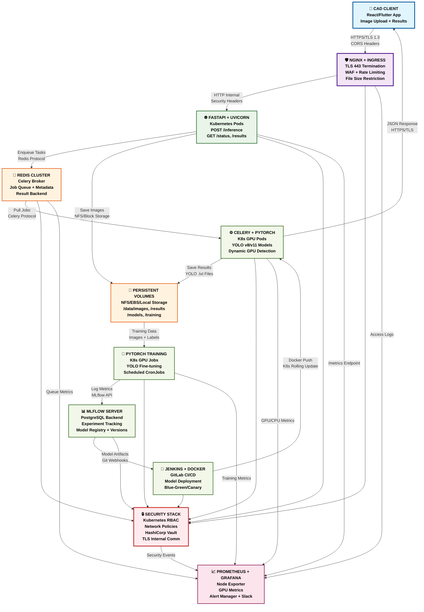
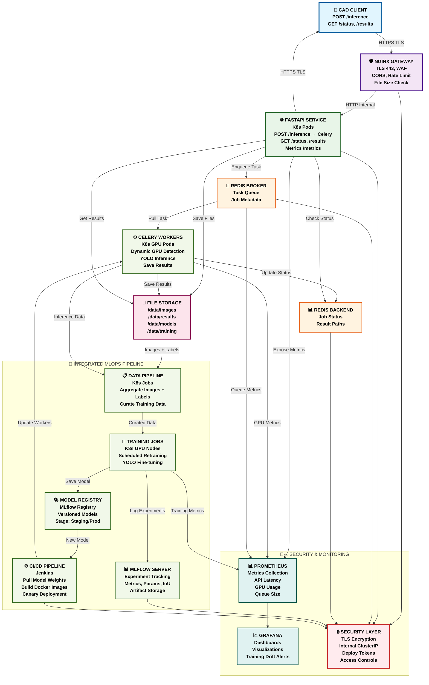
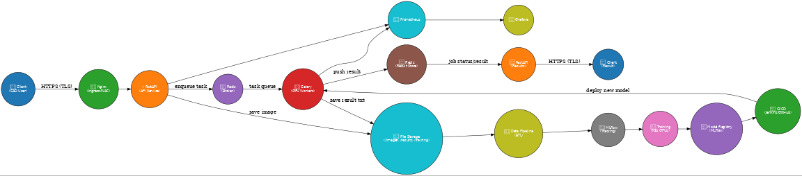

1) Will add a full project here

```mermaid
graph TB
    %% Styling
    classDef client fill:#e1f5fe,stroke:#01579b,stroke-width:3px,color:#000,font-size:14px,font-weight:bold
    classDef security fill:#ffebee,stroke:#c62828,stroke-width:3px,color:#000,font-size:14px,font-weight:bold
    classDef gateway fill:#f3e5f5,stroke:#4a148c,stroke-width:2px,color:#000,font-size:14px,font-weight:bold
    classDef triton fill:#e8f5e8,stroke:#1b5e20,stroke-width:2px,color:#000,font-size:14px,font-weight:bold
    classDef k8s fill:#fff3e0,stroke:#e65100,stroke-width:2px,color:#000,font-size:14px,font-weight:bold
    classDef storage fill:#fce4ec,stroke:#880e4f,stroke-width:2px,color:#000,font-size:14px,font-weight:bold
    classDef mlops fill:#f1f8e9,stroke:#33691e,stroke-width:2px,color:#000,font-size:14px,font-weight:bold
    classDef monitor fill:#e0f2f1,stroke:#004d40,stroke-width:2px,color:#000,font-size:14px,font-weight:bold

    %% Client Layer
    CLIENT["👤 CLIENT APPLICATIONS<br/>Python: requests, aiohttp<br/>JavaScript: axios, fetch<br/>gRPC: tritonclient<br/>HTTP/REST + gRPC protocols"]

    %% Security & Gateway Layer
    subgraph SECURITY_LAYER ["🔐 SECURITY & GATEWAY LAYER"]
        ISTIO["🌐 ISTIO SERVICE MESH<br/>mTLS between services<br/>JWT token validation<br/>Rate limiting policies<br/>Circuit breaker patterns"]
      
        NGINX["🛡️ NGINX INGRESS<br/>SSL termination TLS 1.3<br/>ModSecurity WAF<br/>Rate limiting per IP<br/>Request size limits 100MB"]
      
        OAUTH["🔑 OAUTH2 + KEYCLOAK<br/>Client credentials flow<br/>JWT token validation<br/>RBAC role management<br/>API key authentication"]
      
        VAULT["🗝️ HASHICORP VAULT<br/>Model encryption keys<br/>Database credentials<br/>TLS certificates<br/>Auto rotation policies"]
    end

    %% Kubernetes Control Plane
    subgraph K8S_CONTROL ["⚙️ KUBERNETES CONTROL PLANE"]
        APISERVER["🎛️ K8S API SERVER<br/>RBAC policies<br/>Admission controllers<br/>Network policies<br/>Pod security standards"]
      
        SCHEDULER["📋 K8S SCHEDULER<br/>GPU node affinity<br/>Resource quotas<br/>Taints and tolerations<br/>Priority classes"]
      
        ETCD["💾 ETCD CLUSTER<br/>Encrypted at rest<br/>TLS between nodes<br/>Regular backups<br/>3-5 node cluster"]
    end

    %% Triton Inference Layer
    subgraph TRITON_LAYER ["🚀 TRITON INFERENCE LAYER"]
        TRITON_PODS["🤖 TRITON SERVER PODS<br/>nvcr.io/nvidia/tritonserver:24.01-py3<br/>GPU: V100, A100, RTX series<br/>CUDA 12.0+, TensorRT 8.6+<br/>Memory: 16-80GB per pod"]
      
        MODEL_FORMATS["📋 SUPPORTED MODEL FORMATS<br/>ONNX: .onnx files<br/>TensorRT: .plan engines<br/>PyTorch: TorchScript .pt<br/>TensorFlow: SavedModel .pb<br/>Custom backends: Python/C++"]
      
        BACKENDS["⚡ TRITON BACKENDS<br/>ONNX Runtime backend<br/>TensorRT backend<br/>PyTorch backend<br/>TensorFlow backend<br/>Python backend for custom"]
    end

    %% Model Repository & Storage
    subgraph STORAGE_LAYER ["💾 MODEL REPOSITORY & STORAGE"]
        MODEL_REPO["📚 MODEL REPOSITORY<br/>Structure: model_name/version/model.*<br/>Config: config.pbtxt per model<br/>Versioning: semantic versioning<br/>Hot model swapping support"]
      
        S3_STORAGE["☁️ S3/MINIO STORAGE<br/>Model artifacts storage<br/>Versioned model binaries<br/>Configuration files<br/>Client libraries: boto3, minio"]
      
        PVC["📦 PERSISTENT VOLUMES<br/>StorageClass: fast-ssd<br/>Access: ReadWriteMany<br/>Size: 1-10TB per volume<br/>Backup: Velero snapshots"]
      
        MODEL_LOADER["🔄 MODEL LOADER<br/>DVC for version control<br/>Git LFS for large files<br/>Automated sync from S3<br/>Checksum validation"]
    end

    %% MLOps Pipeline
    subgraph MLOPS_PIPELINE ["🤖 MLOPS PIPELINE"]
        TRAINING["🎯 MODEL TRAINING<br/>Frameworks: PyTorch, TensorFlow<br/>Libraries: transformers, ultralytics<br/>Hardware: Multi-GPU training<br/>Distributed: Horovod, DDP"]
      
        CONVERSION["🔧 MODEL CONVERSION<br/>ONNX: torch.onnx.export<br/>TensorRT: trtexec, TensorRT Python<br/>Optimization: FP16, INT8 quantization<br/>Batch size optimization"]
      
        VALIDATION["✅ MODEL VALIDATION<br/>Accuracy testing<br/>Performance benchmarking<br/>A/B testing framework<br/>Regression testing"]
      
        REGISTRY["📊 MLFLOW REGISTRY<br/>Model versioning<br/>Stage management<br/>Performance metrics<br/>Deployment tracking"]
      
        CICD["🚀 CI/CD PIPELINE<br/>GitLab CI/CD or Jenkins<br/>Docker image building<br/>Kubernetes deployments<br/>Helm charts management"]
    end

    %% Monitoring & Observability
    subgraph MONITORING_LAYER ["📈 MONITORING & OBSERVABILITY"]
        PROMETHEUS["📊 PROMETHEUS STACK<br/>Triton metrics collection<br/>GPU utilization monitoring<br/>Custom metric exporters<br/>AlertManager integration"]
      
        GRAFANA["📈 GRAFANA DASHBOARDS<br/>Real-time inference metrics<br/>GPU memory usage<br/>Request latency P95/P99<br/>Error rate monitoring"]
      
        JAEGER["🔍 DISTRIBUTED TRACING<br/>Request flow tracking<br/>Service dependency mapping<br/>Latency bottleneck analysis<br/>Error propagation tracking"]
      
        ELK["📝 LOGGING STACK<br/>Elasticsearch cluster<br/>Logstash data processing<br/>Kibana visualization<br/>Fluentd log collection"]
    end

    %% Auto Scaling & Load Balancing
    subgraph SCALING_LAYER ["📈 AUTO SCALING & LOAD BALANCING"]
        HPA["🔄 HORIZONTAL POD AUTOSCALER<br/>CPU/GPU based scaling<br/>Custom metrics scaling<br/>Min/Max replica limits<br/>Scale-up/down policies"]
      
        VPA["📊 VERTICAL POD AUTOSCALER<br/>Resource request optimization<br/>Memory/CPU recommendations<br/>Automatic resource updates<br/>Historical usage analysis"]
      
        CLUSTER_AUTO["🌐 CLUSTER AUTOSCALER<br/>Node pool scaling<br/>GPU node provisioning<br/>Cost optimization<br/>Multi-zone support"]
      
        LOAD_BALANCER["⚖️ LOAD BALANCER<br/>Service mesh routing<br/>Health check endpoints<br/>Circuit breaker patterns<br/>Retry mechanisms"]
    end

    %% Development Tools
    subgraph DEV_TOOLS ["🛠️ DEVELOPMENT TOOLS"]
        KUSTOMIZE["📦 KUSTOMIZE<br/>Environment-specific configs<br/>Base + overlay pattern<br/>ConfigMap/Secret generation<br/>Resource transformations"]
      
        HELM["⚡ HELM CHARTS<br/>Templated deployments<br/>Values.yaml configuration<br/>Release management<br/>Rollback capabilities"]
      
        SKAFFOLD["🔧 SKAFFOLD<br/>Local development workflow<br/>Hot reloading<br/>Port forwarding<br/>Log tailing"]
      
        KUBECTL["💻 KUBECTL + PLUGINS<br/>Resource management<br/>Debugging tools<br/>Port forwarding<br/>Log streaming"]
    end

    %% Network Security
    subgraph NETWORK_SECURITY ["🔒 NETWORK SECURITY"]
        NETWORK_POLICIES["🌐 NETWORK POLICIES<br/>Pod-to-pod communication<br/>Ingress/Egress rules<br/>Namespace isolation<br/>Default deny policies"]
      
        CALICO["🛡️ CALICO CNI<br/>Network policy enforcement<br/>Encrypted node communication<br/>Service mesh integration<br/>Security monitoring"]
      
        CERT_MANAGER["🔐 CERT-MANAGER<br/>Automatic TLS certificates<br/>Let's Encrypt integration<br/>Certificate rotation<br/>Custom CA support"]
    end

    %% Connections - Client Flow
    CLIENT -->|"HTTPS/gRPC<br/>Bearer tokens"| NGINX
    NGINX --> OAUTH
    OAUTH --> ISTIO
    ISTIO --> TRITON_PODS
  
    %% Security Integration
    VAULT --> TRITON_PODS
    VAULT --> S3_STORAGE
    VAULT --> REGISTRY
  
    %% Kubernetes Control
    APISERVER --> TRITON_PODS
    SCHEDULER --> TRITON_PODS
    ETCD --> APISERVER
  
    %% Model Management
    S3_STORAGE --> MODEL_LOADER
    MODEL_LOADER --> MODEL_REPO
    MODEL_REPO --> TRITON_PODS
    TRITON_PODS --> MODEL_FORMATS
    MODEL_FORMATS --> BACKENDS
  
    %% MLOps Flow
    TRAINING --> CONVERSION
    CONVERSION --> VALIDATION
    VALIDATION --> REGISTRY
    REGISTRY --> CICD
    CICD --> TRITON_PODS
  
    %% Auto Scaling
    HPA --> TRITON_PODS
    VPA --> TRITON_PODS
    CLUSTER_AUTO --> SCHEDULER
    LOAD_BALANCER --> TRITON_PODS
  
    %% Monitoring
    TRITON_PODS --> PROMETHEUS
    PROMETHEUS --> GRAFANA
    TRITON_PODS --> JAEGER
    TRITON_PODS --> ELK
  
    %% Development Tools
    KUSTOMIZE --> APISERVER
    HELM --> APISERVER
    SKAFFOLD --> KUBECTL
    KUBECTL --> APISERVER
  
    %% Network Security
    NETWORK_POLICIES --> CALICO
    CALICO --> ISTIO
    CERT_MANAGER --> NGINX
    CERT_MANAGER --> ISTIO
  
    %% Storage Integration
    PVC --> TRITON_PODS
    PVC --> S3_STORAGE
  
    %% Apply Styles
    class CLIENT client
    class ISTIO,NGINX,OAUTH,VAULT security
    class APISERVER,SCHEDULER,ETCD,HPA,VPA,CLUSTER_AUTO,LOAD_BALANCER k8s
    class TRITON_PODS,MODEL_FORMATS,BACKENDS triton
    class MODEL_REPO,S3_STORAGE,PVC,MODEL_LOADER storage
    class TRAINING,CONVERSION,VALIDATION,REGISTRY,CICD mlops
    class PROMETHEUS,GRAFANA,JAEGER,ELK monitor
    class KUSTOMIZE,HELM,SKAFFOLD,KUBECTL,NETWORK_POLICIES,CALICO,CERT_MANAGER gateway
```

```mermaid
graph TD
    %% Styling
    classDef client fill:#e1f5fe,stroke:#01579b,stroke-width:3px,color:#000,font-size:16px,font-weight:bold
    classDef gateway fill:#f3e5f5,stroke:#4a148c,stroke-width:3px,color:#000,font-size:16px,font-weight:bold
    classDef api fill:#e8f5e8,stroke:#1b5e20,stroke-width:2px,color:#000,font-size:16px,font-weight:bold
    classDef storage fill:#fff3e0,stroke:#e65100,stroke-width:2px,color:#000,font-size:16px,font-weight:bold
    classDef ml fill:#f1f8e9,stroke:#33691e,stroke-width:2px,color:#000,font-size:16px,font-weight:bold
    classDef security fill:#ffebee,stroke:#c62828,stroke-width:3px,color:#000,font-size:16px,font-weight:bold
    classDef ops fill:#fce4ec,stroke:#880e4f,stroke-width:2px,color:#000,font-size:16px,font-weight:bold

    %% Client & Gateway
    CLIENT["👤 CAD CLIENT<br/>React/Flutter App<br/>Image Upload + Results"]
  
    NGINX["🛡️ NGINX + INGRESS<br/>TLS 443 Termination<br/>WAF + Rate Limiting<br/>File Size Restriction"]

    %% API Layer
    FASTAPI["🌐 FASTAPI + UVICORN<br/>Kubernetes Pods<br/>POST /inference<br/>GET /status, /results"]

    %% Core Services
    REDIS["📨 REDIS CLUSTER<br/>Celery Broker<br/>Job Queue + Metadata<br/>Result Backend"]
  
    STORAGE["💾 PERSISTENT VOLUMES<br/>NFS/EBS/Local Storage<br/>/data/images, /results<br/>/models, /training"]
  
    WORKERS["⚙️ CELERY + PYTORCH<br/>K8s GPU Pods<br/>YOLO v8/v11 Models<br/>Dynamic GPU Detection"]

    %% MLOps Components
    TRAINING["🎯 PYTORCH TRAINING<br/>K8s GPU Jobs<br/>YOLO Fine-tuning<br/>Scheduled CronJobs"]
  
    MLFLOW["📊 MLFLOW SERVER<br/>PostgreSQL Backend<br/>Experiment Tracking<br/>Model Registry + Versions"]
  
    CICD["🚀 JENKINS + DOCKER<br/>GitLab CI/CD<br/>Model Deployment<br/>Blue-Green/Canary"]

    %% Security Layer
    SECURITY["🔒 SECURITY STACK<br/>Kubernetes RBAC<br/>Network Policies<br/>HashiCorp Vault<br/>TLS Internal Comm"]

    %% Monitoring
    MONITORING["📈 PROMETHEUS + GRAFANA<br/>Node Exporter<br/>GPU Metrics<br/>Alert Manager + Slack"]

    %% Main Flow
    CLIENT -->|"HTTPS/TLS 1.3<br/>CORS Headers"| NGINX
    NGINX -->|"HTTP Internal<br/>Security Headers"| FASTAPI
    FASTAPI -->|"Enqueue Tasks<br/>Redis Protocol"| REDIS
    FASTAPI -->|"Save Images<br/>NFS/Block Storage"| STORAGE
    REDIS -->|"Pull Jobs<br/>Celery Protocol"| WORKERS
    WORKERS -->|"Save Results<br/>YOLO .txt Files"| STORAGE
    WORKERS -->|"JSON Response<br/>HTTPS/TLS"| CLIENT

    %% MLOps Flow
    STORAGE -->|"Training Data<br/>Images + Labels"| TRAINING
    TRAINING -->|"Log Metrics<br/>MLflow API"| MLFLOW
    MLFLOW -->|"Model Artifacts<br/>Git Webhooks"| CICD
    CICD -->|"Docker Push<br/>K8s Rolling Update"| WORKERS

    %% Security Integration
    NGINX --> SECURITY
    FASTAPI --> SECURITY
    REDIS --> SECURITY
    WORKERS --> SECURITY
    TRAINING --> SECURITY
    MLFLOW --> SECURITY
    CICD --> SECURITY

    %% Monitoring Integration
    FASTAPI -->|"/metrics Endpoint"| MONITORING
    WORKERS -->|"GPU/CPU Metrics"| MONITORING
    TRAINING -->|"Training Metrics"| MONITORING
    REDIS -->|"Queue Metrics"| MONITORING
    NGINX -->|"Access Logs"| MONITORING
    SECURITY -->|"Security Events"| MONITORING

    %% Apply Styles
    class CLIENT client
    class NGINX gateway
    class FASTAPI api
    class REDIS,STORAGE storage
    class WORKERS,TRAINING,MLFLOW,CICD ml
    class SECURITY security
    class MONITORING ops
```

```mermaid
graph TD
    %% Styling
    classDef client fill:#e1f5fe,stroke:#01579b,stroke-width:3px,color:#000,font-size:16px,font-weight:bold
    classDef gateway fill:#f3e5f5,stroke:#4a148c,stroke-width:3px,color:#000,font-size:16px,font-weight:bold
    classDef api fill:#e8f5e8,stroke:#1b5e20,stroke-width:2px,color:#000,font-size:16px,font-weight:bold
    classDef queue fill:#fff3e0,stroke:#e65100,stroke-width:2px,color:#000,font-size:16px,font-weight:bold
    classDef storage fill:#fce4ec,stroke:#880e4f,stroke-width:2px,color:#000,font-size:16px,font-weight:bold
    classDef ml fill:#f1f8e9,stroke:#33691e,stroke-width:2px,color:#000,font-size:16px,font-weight:bold
    classDef security fill:#ffebee,stroke:#c62828,stroke-width:3px,color:#000,font-size:16px,font-weight:bold
    classDef monitor fill:#e0f2f1,stroke:#004d40,stroke-width:2px,color:#000,font-size:16px,font-weight:bold

    %% Client Layer
    CLIENT["👤 CAD CLIENT<br/>POST /inference<br/>GET /status, /results"]

    %% Security Gateway
    NGINX["🛡️ NGINX GATEWAY<br/>TLS 443, WAF<br/>CORS, Rate Limit<br/>File Size Check"]

    %% API Service
    FASTAPI["🌐 FASTAPI SERVICE<br/>K8s Pods<br/>POST /inference → Celery<br/>GET /status, /results<br/>Metrics /metrics"]

    %% Queue & Storage
    REDIS_BROKER["📨 REDIS BROKER<br/>Task Queue<br/>Job Metadata"]
    REDIS_BACKEND["📊 REDIS BACKEND<br/>Job Status<br/>Result Paths"]
    FILESTORAGE["💾 FILE STORAGE<br/>/data/images<br/>/data/results<br/>/data/models<br/>/data/training"]

    %% Inference Workers
    CELERY["⚙️ CELERY WORKERS<br/>K8s GPU Pods<br/>Dynamic GPU Detection<br/>YOLO Inference<br/>Save Results"]

    %% MLOps Pipeline Integration
    subgraph MLOPS ["🤖 INTEGRATED MLOPS PIPELINE"]
    
        %% Data Pipeline
        DATAPIPE["📋 DATA PIPELINE<br/>K8s Jobs<br/>Aggregate Images + Labels<br/>Curate Training Data"]
    
        %% Experiment Tracking
        MLFLOW["📊 MLFLOW SERVER<br/>Experiment Tracking<br/>Metrics, Params, IoU<br/>Artifact Storage"]
    
        %% Training
        TRAINING["🎯 TRAINING JOBS<br/>K8s GPU Nodes<br/>Scheduled Retraining<br/>YOLO Fine-tuning"]
    
        %% Model Registry
        REGISTRY["📚 MODEL REGISTRY<br/>MLflow Registry<br/>Versioned Models<br/>Stage: Staging/Prod"]
    
        %% CI/CD
        CICD["⚙️ CI/CD PIPELINE<br/>Jenkins<br/>Pull Model Weights<br/>Build Docker Images<br/>Canary Deployment"]
    end

    %% Monitoring & Security Layer
    subgraph SECURITY_MONITOR ["🔐📈 SECURITY & MONITORING"]
        PROMETHEUS["📊 PROMETHEUS<br/>Metrics Collection<br/>API Latency<br/>GPU Usage<br/>Queue Size"]
    
        GRAFANA["📈 GRAFANA<br/>Dashboards<br/>Visualizations<br/>Training Drift Alerts"]
    
        SECURITY_LAYER["🔒 SECURITY LAYER<br/>TLS Encryption<br/>Internal ClusterIP<br/>Deploy Tokens<br/>Access Controls"]
    end

    %% Primary Flow
    CLIENT -->|HTTPS TLS| NGINX
    NGINX -->|HTTP Internal| FASTAPI
    FASTAPI -->|Enqueue Task| REDIS_BROKER
    FASTAPI -->|Save Files| FILESTORAGE
    REDIS_BROKER -->|Pull Task| CELERY
    CELERY -->|Save Results| FILESTORAGE
    CELERY -->|Update Status| REDIS_BACKEND
    FASTAPI -->|Check Status| REDIS_BACKEND
    FASTAPI -->|Get Results| FILESTORAGE
    FASTAPI -->|HTTPS TLS| CLIENT

    %% MLOps Integration Flow
    FILESTORAGE -->|Images + Labels| DATAPIPE
    DATAPIPE -->|Curated Data| TRAINING
    TRAINING -->|Log Experiments| MLFLOW
    TRAINING -->|Save Model| REGISTRY
    REGISTRY -->|New Model| CICD
    CICD -->|Update Workers| CELERY
  
    %% Feedback Loop
    CELERY -->|Inference Data| DATAPIPE

    %% Monitoring Connections
    FASTAPI -->|Expose Metrics| PROMETHEUS
    CELERY -->|GPU Metrics| PROMETHEUS
    REDIS_BROKER -->|Queue Metrics| PROMETHEUS
    TRAINING -->|Training Metrics| PROMETHEUS
    PROMETHEUS --> GRAFANA

    %% Security Integration
    NGINX --> SECURITY_LAYER
    FASTAPI --> SECURITY_LAYER
    REDIS_BROKER --> SECURITY_LAYER
    REDIS_BACKEND --> SECURITY_LAYER
    MLFLOW --> SECURITY_LAYER
    CICD --> SECURITY_LAYER

    %% Apply Styles
    class CLIENT client
    class NGINX gateway
    class FASTAPI api
    class REDIS_BROKER,REDIS_BACKEND queue
    class FILESTORAGE storage
    class CELERY,DATAPIPE,MLFLOW,TRAINING,REGISTRY,CICD ml
    class SECURITY_LAYER security
    class PROMETHEUS,GRAFANA monitor

```

