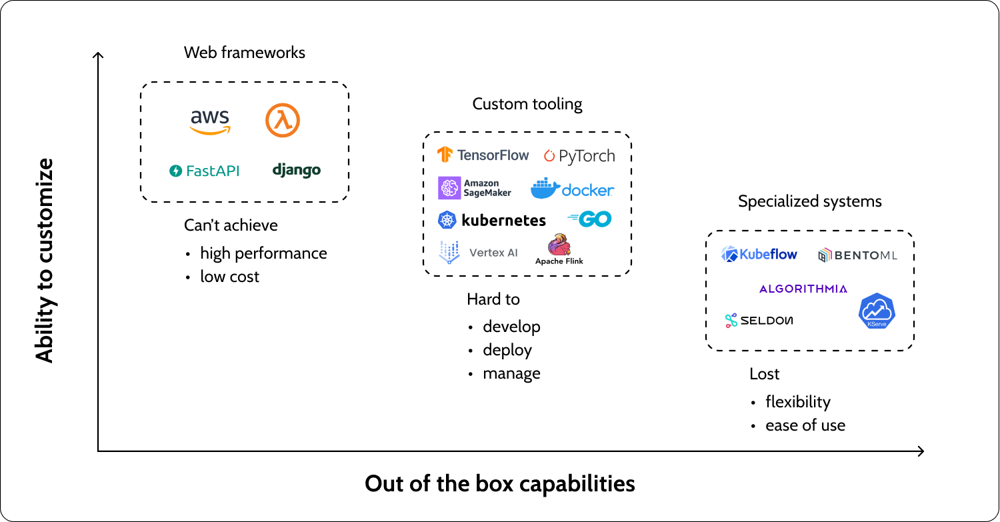

# Handling Server



[refrence](https://superwise.ai/blog/kserve-vs-seldon-core/)


**Server Handler - get request from client and send response to client**


**Server Engine - handle the request and process required tasks in server side**


**Server Handler- send response to client server**

 In this project we are implementing FASTAPI as server handler and server engine. So there are several methods to handle server post request.

 One important point is that FASTAPI direclt doesn't allow us to send multiple response to client. So we have to use some other methods to send multiple response to client such as `Zip and send`, `Streeaming response`, or `multiple file upload endpoint`.

For example:

```pyhton
from fastapi import FastAPI
from fastapi.responses import FileResponse
import zipfile
import os
from tempfile import NamedTemporaryFile

app = FastAPI()

@app.get("/download-files")
async def download_files():
    # List of files to be zipped and sent
    files_to_send = ["/path/to/file1.txt", "/path/to/file2.pdf", "/path/to/file3.jpg"]
    
    # Create a temporary zip file
    with NamedTemporaryFile(delete=False) as tmp_zip:
        with zipfile.ZipFile(tmp_zip, 'w', zipfile.ZIP_DEFLATED) as archive:
            for file_path in files_to_send:
                archive.write(file_path, os.path.basename(file_path))
        
        # Return the zip file as a response
        return FileResponse(
            tmp_zip.name,
            media_type="application/zip",
            filename="files.zip"
        )
```


Another method for streaming response is as follows:

```python
from fastapi import FastAPI
from fastapi.responses import StreamingResponse
import io
import zipfile

app = FastAPI()

@app.get("/stream-files")
async def stream_files():
    files_to_send = ["/path/to/file1.txt", "/path/to/file2.pdf", "/path/to/file3.jpg"]
    
    def iter_files():
        with io.BytesIO() as zip_buffer:
            with zipfile.ZipFile(zip_buffer, 'w', zipfile.ZIP_DEFLATED) as zip_file:
                for file_path in files_to_send:
                    zip_file.write(file_path)
            yield zip_buffer.getvalue()
    
    return StreamingResponse(
        iter_files(),
        media_type="application/zip",
        headers={"Content-Disposition": "attachment; filename=files.zip"}
    )
```

And multiple file upload endpoint is as follows:

```python

from fastapi import FastAPI, File, UploadFile
from typing import List

app = FastAPI()

@app.post("/upload-files/")
async def create_upload_files(files: List[UploadFile] = File(...)):
    return {"filenames": [file.filename for file in files]}

```


**Receive data in client side**


References:
- https://medium.com/israeli-tech-radar/machine-learning-model-serving-overview-c01a6aa3e823